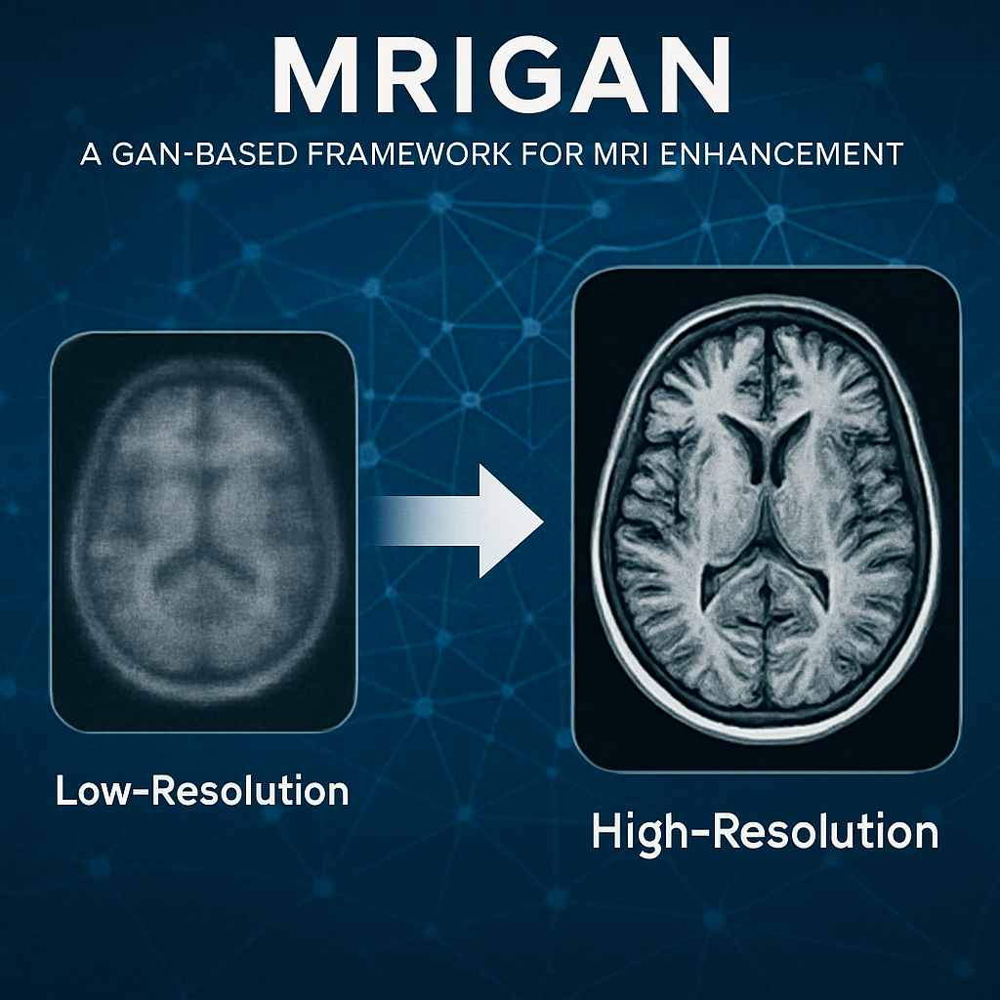
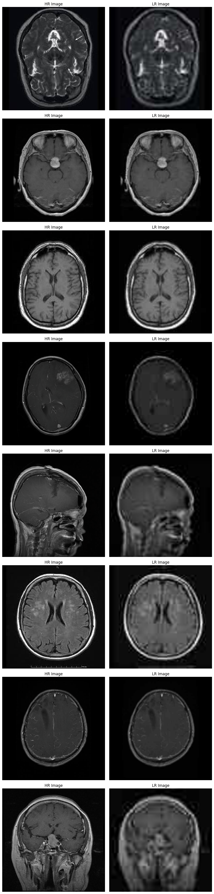
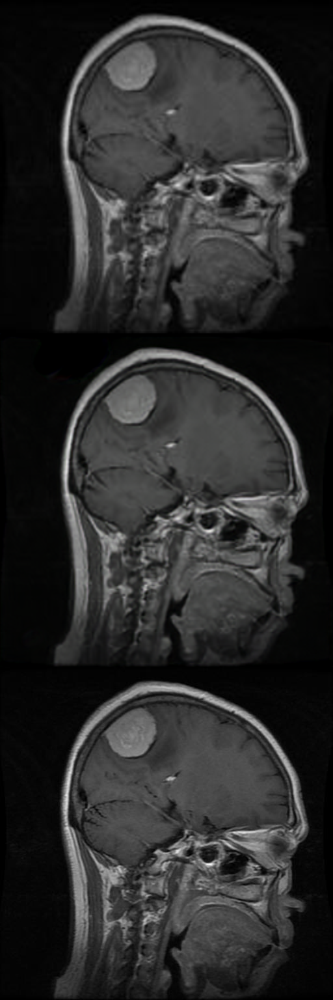

<p align="center">  </p>
</p>
<h1 align="center">MRIGAN: GAN-based MRI Image Super-Resolution
</h1>
<h2 align="center">(Proof Of Concept) - project under enhancement</h2>
<p align="center"> 
    MRIGAN is a GAN-based framework designed to enhance and upscale low-resolution MRI images. The project simulates degraded MRI scans by applying random transformations and augmentations to generate corresponding low-resolution (LR) inputs. These LR images are then fed into a Generative Adversarial Network (GAN) that learns to reconstruct high-quality versions, aiming to improve visual clarity and diagnostic usability.

## 📝 Table of Contents

- [About](#about)
- [Installation](#installation)
- [Data Preparation](#data-preparation)
- [Training & Evaluation](#training-evaluation)
- [Author](#author)

## 🧐 About <a name="about"></a>

**MRIGAN** is a proof-of-concept framework that applies Generative Adversarial Networks (GANs) for MRI image super-resolution. Built on the Brain Tumor MRI Dataset, the system simulates low-resolution (LR) scans by applying random augmentations and quality-reducing transformations to high-resolution (HR) images. These LR images are then used to train GAN models that learn to reconstruct high-quality MRI scans.

Key features include:

-**Data Simulation Pipeline:** Automatically augments and degrades original MRI scans to generate realistic LR-HR training pairs.


-**Flexible Loss Design:** Supports multiple loss functions, including pixel-wise losses (L1 or SIlog) and losses employed in SRGAN for enhanced image fidelity with OneCycle Learning Policy for fast convergence.

## 📦 Installation <a name="installation"></a>

### Prerequisites
- Git
- Anaconda/Miniconda

### Steps
Clone the repository:

```bash
git clone https://github.com/Chaouki-AI/MRIGAN
cd MRIGAN
chmod +x ./installEnv.sh
./installEnv.sh
conda activate MRIGAN
```

## 📂 Data Preparation <a name="data-preparation"></a>
This project uses a publicly available Brain Tumor MRI dataset, which contains MRI scans originally designed for classification tasks and categorized into four classes:
- Glioma
- Meningioma
- Pituitary
- No Tumor

For the purposes of super-resolution training, each image undergoes a unique set of random transformations, including:

- **Gaussian blurring**
- **JPEG compression noise**
- **Downscaling**

These transformations are carefully designed to mimic real-world image degradation scenarios, resulting in realistic low-resolution (LR) inputs. The original high-resolution images serve as ground truth targets for the GAN-based super-resolution models.


Download the dataset from the [official website](https://www.kaggle.com/datasets/masoudnickparvar/brain-tumor-mri-dataset/) and extract it to get the following structure: 

```bash
MRIGAN/
└── data/
    ├── training/
    |      ├── Glioma/
    |      ├── Meningioma/    
    |      ├── Pituitary/
    |      └── No Tumor/
    └── testing/
           ├── Glioma/
           ├── Meningioma/    
           ├── Pituitary/
           └── No Tumor/
```
The Result of the transormations on a random samples are like the following: 
<p align="center">  </p>
 
## 🚀 Training & Evaluation <a name="training-evaluation"></a>
in order to train the model please update the [args.txt](args.txt)
file with your preferred configuration before training. Below is a description of each available argument:
```bash
# Training Parameters
epochs        : Number of training epochs
bs            : Batch size used during training

# Image Settings
--RGB         : Use grayscale images (default). If not set, RGB images will be used instead.
--height      : Input image height in pixels
--width       : Input image width in pixels

# Loss Function
--loss        : Loss function to use during training
                Options:
                - L1     : Mean Absolute Error
                - SIlog  : Scale-Invariant Logarithmic Loss (default)
                - SRLOSS : Super-Resolution-specific loss

# Data Path
--data_path   : Path to the folder containing images

# Optimizer Settings
--optimizer   : Optimizer to use for training
                Options:
                - AdamW   : Adam optimizer with weight decay (default)
                - RMSprop : Root Mean Square Propagation

--lr / --learning-rate : Learning rate for the optimizer
--wd / --weight-decay  : Weight decay (L2 regularization strength)

```
and then run the following to train your model 

```bash
python train.py @args.txt
```
the train will start accordingly and two folders will created, checkpoints to save the trained generator and runs to save the tensorboard events.
The image bellow is a sample of (Top) Low resolution image, (middle) the result of the model after 5 epochs of
 training only (Bottom) the ground truth high resolution image. 
<p align="center">  </p>

## ✍️ Author <a name="author"></a>

[M. Chaouki ZIARA](https://github.com/Chaouki-AI) is affiliated with the RCAM Laboratory, Department of Electronics, Djillali Liabes University, Sidi Bel Abbes, Algeria. (Email: chaouki.ziara@univ-sba.dz, medchaoukiziara@gmail.com) – concept creator, algorithm development, implementation, and manuscript writing.